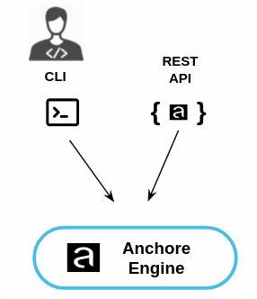

The Anchore engine exposes two RESTful web services:

- API Service : The public interface to the Anchore Engine providing APIs to allow management and inspection of images, policies, subscriptions and registries.
- Kubernetes WebHook : An optional service exposing the Kubernetes Image Policy WebHook interface.

While the Anchore Engine can be accessed directly through the REST API the simplest way to interact with the Anchore Engine is using the Anchore command line utility that provides a simple interface to manage and interact with the Anchore Engine from Linux, Mac or Windows.

Using the REST API or CLI the Anchore Engine can be queried for image data and policy evaluations

- Image metadata
- Image content (files, packages, software libraries)
- Image vulnerabilities 
- Historic image data
- Image policy status