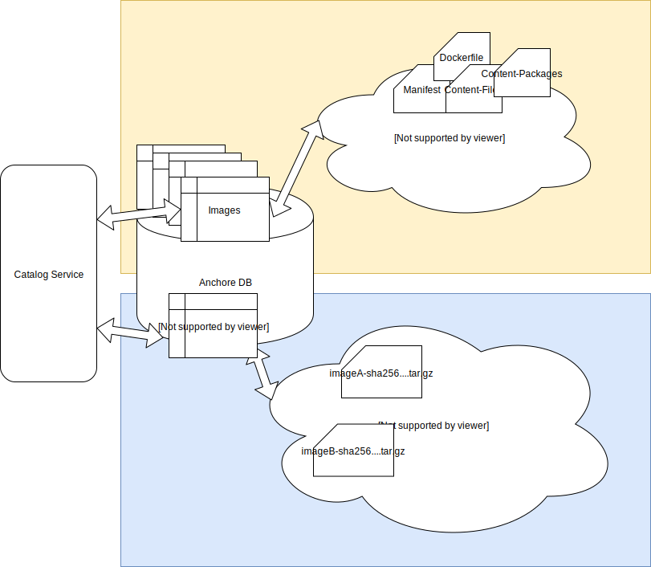

Anchore Engine is a data intensive system. Storage consumption grows with the number of images analyzed, which leaves the
following options for storage management:

1. Over-provisioning storage significantly
2. Increasing capacity over time, resulting in downtime (e.g. stop system, grow the db volume, restart)
3. Manually deleting image analysis to free space as needed

In most cases, option 1 only works for a while, which then requires using 2 or 3. Managing storage provisioned for a 
postgres DB is somewhat complex and may require significant data copies to new volumes to grow capacity over time.

To help mitigate the storage growth of the db itself, Anchore Engine already provides an object storage subsystem that 
enables using external object stores like S3 or Swift to offload the unstructured data storage needs to systems that are 
more growth tolerant and flexible. This lowers the db overhead but does not fundamentally address the issue of unbounded 
growth in a busy system.

The Analysis Archive extends the object store even further by providing a system-managed way to move an image analysis 
and all of its related data (policy evaluations, tags, annotations, etc) and moving it to a location outside of the main
set of images such that it consumes much less storage in the database when using an object store, perserves the last 
state of the image, and supports moving it back into the main image set if it is needed in the future without requiring 
that the image itself be reanalzyed--restoring from the archive does not require the actual docker image to exist at all.

To facilitate this, the system can be thought of as two sets of analysis with different capabilities and properties:



### Working Set Images

The working set is the set of images in the 'analyzed' state in the system. These images are stored in the database, 
optionally with some data in an external object store. Specifically:

* State = 'analyzed'
* The set of images available from the _/images_ api routes
* Available for policy evaluation, content queries, and vulnerability updates

### Archive Set Images

The archive set of images are image analyses that reside almost entirely in the object store, which can be configured to
be a different location than the object store used for the working set, with minimal metadata in the anchore DB necessary
to track and restore the analysis back into the working set in the future. An archived image analysis preserves all the
annotations, tags, and metadata of the original analysis as well as all existing policy evaluation histories, but
are not updated with new vulnerabilities during feed syncs and are not available for new policy evaluations or content
queries without first being restored into the working set.

* Not listed in _/images_ API routes
* Cannot have policy evaluations executed
* No vulnerability updates automatically (must be restored to working set first)
* Available from the _/archives/images_ API routes
* Point-in-time snapshot of the analysis, policy evaluation, and vulnerability state of an image
* Independently configurable storage location (_analysis_archive_ property in the _services.catalog_ property of config.yaml)
* Small db storage consumption (if using external object store, only a few small records, bytes)
* Able to use different type of storage for cost effectiveness
* Can be restored to the working set at any time to restore full query and policy capabilities
* The archive object store is not used for any API operations other than the restore process


An image analysis, identified by the digest of the image, may exist in both sets at the same time, they are not mutually
exclusive, however the archive is not automatically updated and must be deleted an re-archived to capture updated state 
from the working set image if desired.

## Benefits of the Archive

Because archived image analyses are stored in a distinct object store and tracked with their own metadata in the db, the
images in that set will not impact the performance of working set image operations such as API operations, feed syncs, or
notification handling. This helps keep the system responsive and performant in cases where the set of images that you're
interested in is much smaller than the set of images in the system, but you don't want to delete the analysis because it 
has value for audit or historical reasons.

1. Leverage cheaper and more scalable cloud-based storage solutions (e.g. S3 IA class)
2. Keep the working set small to manage capacity and api performance
3. Ensure the working set is images you actively need to monitor without losing old data by sending it to the archive 


## Automatic Archiving

The help facilitate data management automatically, Anchore supports rules to define which data to archive and when 
based on a few qualities of the image analysis itself. These rules are evaluated periodically by the system.

Anchore supports both account-scoped rules, editable by users in the account, and global system rules, editable only by
the system admin account users. All users can view system global rules such that they can understand what will affect
their images but they cannot update or delete the rules.

The process of automatic rule evaluation:

1. The catalog component periodically (daily by default, but configurable) will run through each rule in the system and
identify image digests should be archived according to either account-local rules or system global rules.
 
2. Each matching image analysis is added to the archive.

3. Each successfully added analysis is deleted from the working set.

4. For each digest migrated, a system event log entry is created, indicating that the image digest was moved to the 
archive.


## Archive Rules

The rules that match images are provide 3 selectors:

1. Analysis timestamp - the age of the analysis itself, as expressed in days
2. Source metadata (registry, repo, tag) - the values of the registry, repo, and tag values
3. Tag history depth -- the number of images mapped to a tag ordered by detected_at timestamp (the time at which the 
system observed the mapping of a tag to a specific image manifest digest)

Rule scope:

* global - these rules will be evaluated against all images and all tags in the system, regardless of the owning account.
 (system_global = true)
* account - these rules are only evaluated against the images and tags of the account which owns the rule. (system_global = false)

Example Rule:

```
{
    "analysis_age_days": 10,
    "created_at": "2019-03-30T22:23:50Z",
    "last_updated": "2019-03-30T22:23:50Z",
    "rule_id": "67b5f8bfde31497a9a67424cf80edf24",
    "selector": {
        "registry": "*",
        "repository": "*",
        "tag": "*"
    },
    "system_global": false,
    "tag_versions_newer": 10,
    "transition": "archive"
}
```

* selector: a json object defining a set of filters on registry, repository, and tag that this rule will apply to.
  * Each entry supports wildcards. e.g. `{"registry": "*", "repository": "library/*", "tag": "latest"}`
* tag_versions_newer: the minimum number of tag->digest mappings with newer timestamps that must be preset for this rule to 
match an image tag.
* analysis_age_days: the minimum age of the analysis to match, as indicated by the 'analyzed_at' timestamp on the image record.
* transition: the operation to perform, one of the following
  * _archive_: works on the working set and transitions to archive, while deleting the source analysis upon successful
  archive creation. Specifically: the analysis will "move" to the archive and no longer be in the working set.
  * _delete_: works on the archive set and deletes the archived record on a match


### Rule conflicts and application:

For an image to be transitioned by a rule it must:

* Match at least 1 rule for each of its tag entries (either in working set if transition is _archive_ or those in the 
archive set, if a _delete_ transition)
* All rule matches must be of the same scope, global and account rules cannot interact

Put another way, if any tag record for an image analysis is not defined to be transitioned, then the analysis record is 
not transitioned.


## Usage

Image analysis can be archived explicitly via the API (and CLI) as well as restored. Alternatively, the API and CLI can
manage the rules that control automatic transitions. For more information see the following:

### Archiving an Image Analysis

See: [Archiving an Image]()

### Restoring an Image Analysis

See: [Restoring an Image]()

### Managing Archive Rules

See: [Working with Archive Rules]()

