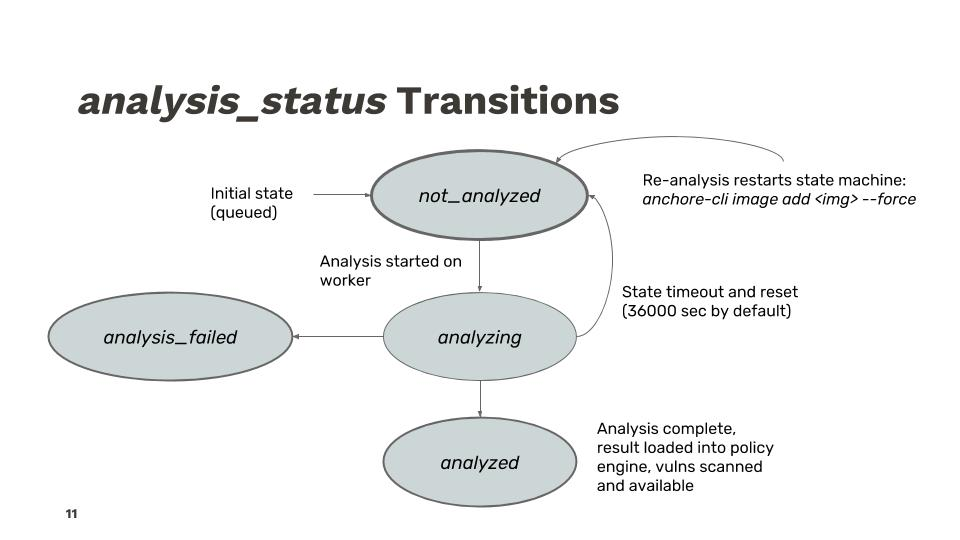
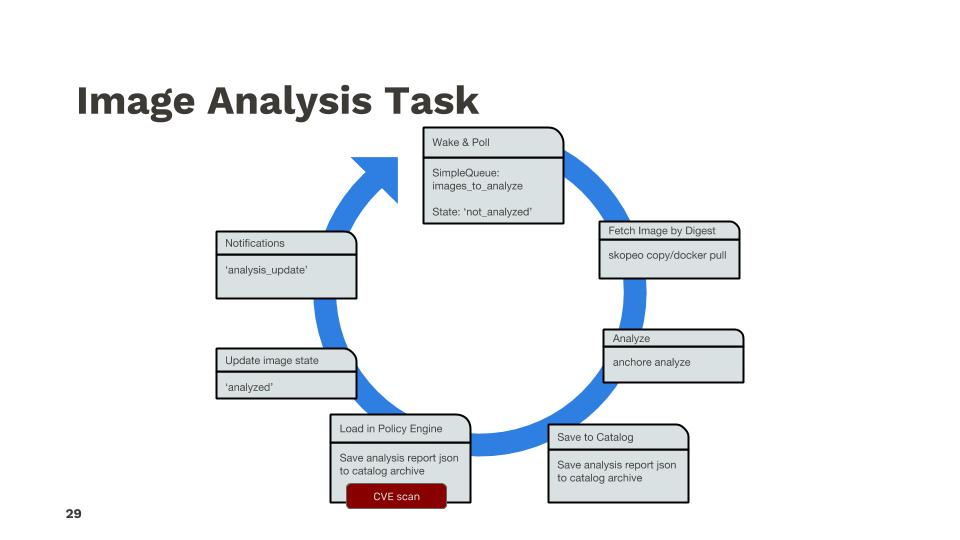
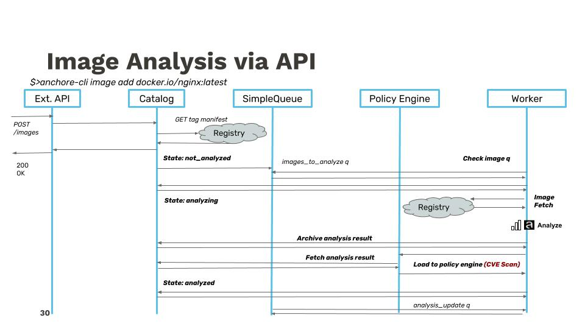

Image analysis is performed as a distinct, asynchronous, and scheduled task driven by queues that analyzer workers periodically poll. Image records have a small state-machine as follows:

The analysis process is composed of several steps and utilizes several system components. The, basic flow of that task is as follows:

Adding more detail, the API call trace between services looks approximately like (somewhat simplified for ease of presentation):

### Next Steps

Now let's get familiar with [Watching Images and Tags]() with Anchore.
