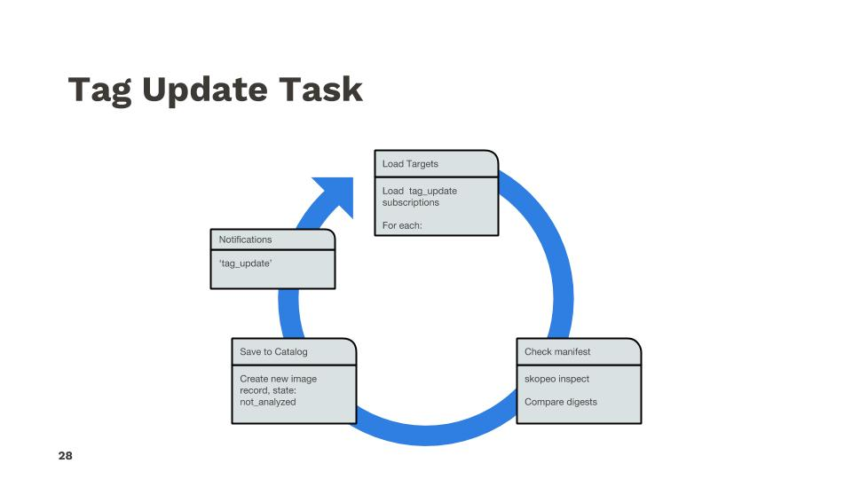

### Overview

Anchore has the capability to monitor external Docker Registries for updates to tags as well as new tags. It also watches for updates to vulnerability databases and package metadata (the "Feeds").

### Repository Updates: New Tags

The process for monitoring updates to repositories, the addition of new tag names, is done on a duty cycle and performed by the Engine Catalog component(s). The scheduling and tasks are driven by queues provided by the SimpleQueue service.

1. Periodically, controlled by the cycle_timers configuration in the config.yaml of the catalog, a process is triggered to list all the Repository Subscription records in the system and for each record, add a task to a specific queue.
2. Periodically, also controlled by the cycle_timers config, a process is triggered to pick up tasks off that queue and process repository scan tasks. Each task looks approximately like the following:

The output of this process is new tag_update subscription records, which are subsequently processed by the Tag Update handlers as described below. You can view the tag_update subscriptions using the Anchore CLI:

`anchore-cli subscription list | grep tag_update`

### Tag Updates: New Images

To detect updates to tags, mapping of a new image digest to a tag name, Anchore periodically checks the registry and downloads the tag's image manifest to compare the computed digests. This is done on a duty cycle for every tag_update subscription record. Therefore, the more subscribed tags exist in the system, the higher the load on the system to check for updates and detect changes. This processing, like repository update monitoring, is performed by the Catalog component(s).

The process, the duty-cycle of which is configured in the cycle_timers section of the catalog config.yaml is described below:

As new updates are discovered, they are automatically submitted to the analyzers, via the image analysis internal queue, for processing.

The overall process and interaction of these duty cycles works like:

### Next Steps

Now let's get familiar with [Policies]() in Anchore.
