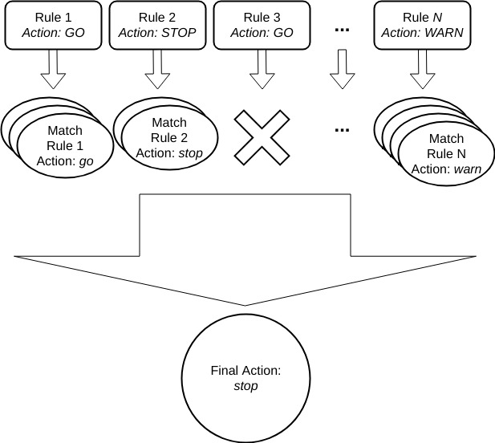

### Overview

A policy is a named set of rules, represented as a JSON object within a Policy Bundle, each of which define a specific check to perform and an resulting action to emit if the check returns a match against then image analysis.

A policy:

- ID: a unique id for the policy within the bundle
- Name: a human readable name to give the policy (may contain spaces etc)
- A list of rules to define what to evaluate and the action to recommend on any matches for the rule

A simple example of a policy JSON object (found within a larger policy bundle object):

```JSON
{
  "name": "DefaultPolicy",
  "version": "1_0",
  "comment": "Policy for basic checks",
  "id": "policy1",
  "rules": [
      {
        "action": "STOP",
        "gate": "vulnerabilities",
        "id": "rule1",
        "params": [
          { "name": "package_type", "value": "all" },
          { "name": "severity_comparison", "value": ">=" },
          { "name": "severity", "value": "medium" }
        ],
        "trigger": "package"
      }
  ]
}
```

The above example defines a stop action to be produced for all package vulnerabilities found in an image that are severity *medium* or higher.

Policy evaluation is the execution of all defined triggers in the policy against the image analysis result and feed data and results in a set of output trigger matches, each of which contains the *defined* action from the rule definition. The final recommendation value for the policy evaluation is called the *final action*, and is computed from the set of output matches: *stop*, *go*, or *warn*.



### Policy Rules

Rules define the behavior of the policy at evaluation time. Each rule defines:

- Gate - Example: dockerfile
- Trigger - Example: *exposed_ports*
- Parameters - Parameters specific to the gate/trigger to customize its match behavior
- Action - The action to emit if a trigger evaluation finds a match. One of *stop*, *go*, *warn*. The only semantics of these values are in the aggregation behavior for the policy result.

### Gates

A "Gate" is a logical grouping of trigger definitions and provides a broader context for the execution of triggers against image analysis data. You can think of gates as the "things to be checked", while the triggers provide the "which check to run" context. Gates do not have parameters themselves, but namespace the set of triggers to ensure there are no name conflicts.

Examples of gates:

- *vulnerabilities*
- *packages*
- *npms*
- *files*
- *...*

For a complete listing see: Anchore Policy Checks

### Triggers

Triggers define a specific condition to check within the context of a gate, optionally with one or more input parameters. A trigger is logically a piece of code that executes with the image analysis content and feed data as inputs and performs a specific check. A trigger emits matches for each instance of the condition for which it checks in the image. Thus, a single gate/trigger policy rule may result in many matches in final policy result, often with different match specifics (e.g. package names, cves, or filenames...).

Trigger parameters are passed as name, value pairs in the rule JSON:

```JSON
{
  "action": "WARN",
  "parameters": [
    {  "name": "param1", "value": "value1" },
    {  "name": "param2", "value": "value2" },
    {  "name": "paramN", "value": "valueN" }
  ],
  "gate": "vulnerabilities",
  "trigger": "packages",
}
```

For a complete listing of gates, triggers, and the parameters, see: Anchore Policy Checks

### Policy Evaluation

- All rules in a selected policy are evaluated, no short-circuits
- Rules who's triggers and parameters find a match in the image analysis data, will "fire" resulting in a record of the match and parameters. A trigger may fire many times during an evaluation (e.g. many cves found).
- Each firing of a trigger generates a trigger_id for that match
- Rules may be executed in any order, and are executed in isolation (e.g. conflicting rules are allowed, it's up to the user to ensure that policies make sense)

See Anchore Policy Checks for a complete list of all gates, triggers, and parameters

Each output match from a rule contains the matching rule's:

- Gate
- Trigger
- A trigger_id identifying the match
- Check Output -  A short message (human readable) describing the condition and match details
- Whitelisted - a JSON object of details about a whitelist match (whitelist id and whitelist item id if available), or a 'false' if the match was not whitelisted
- Policy ID - the id of the policy that generated this match, to disambiguate in cases where multiple policies are evaluated as defined in the bundle. See: policy bundle

Excerpt from a bundle evaluation, showing just the policy evaluation output:

```
...
"result": {
  "final_action": "warn",
  "header": [
    "Image_Id",
    "Repo_Tag",
    "Trigger_Id",
    "Gate",
    "Trigger",
    "Check_Output",
    "Gate_Action",
    "Whitelisted",
    "Policy_Id"
  ],
  "row_count": 55,
  "rows": [
    [
      "52fe93b8eea726594f3b8efefedc2e3a1db02828ab57632b217b953f00192950",
      "docker.io/node:latest",
      "CVE-2008-3134+imagemagick-6.q16",
      "vulnerabilities",
      "package",
      "MEDIUM Vulnerability found in os package type (dpkg) - imagemagick-6.q16 (CVE-2008-3134 - https://security-tracker.debian.org/tracker/CVE-2008-3134)",
      "go",
      false,
      "48e6f7d6-1765-11e8-b5f9-8b6f228548b6"
    ],
    [
      "52fe93b8eea726594f3b8efefedc2e3a1db02828ab57632b217b953f00192950",
      "docker.io/node:latest",
      "CVE-2008-3134+libmagickwand-6.q16-2",
      "vulnerabilities",
      "package",
      "MEDIUM Vulnerability found in os package type (dpkg) - libmagickwand-6.q16-2 (CVE-2008-3134 - https://security-tracker.debian.org/tracker/CVE-2008-3134)",
      "go",
      false,
      "48e6f7d6-1765-11e8-b5f9-8b6f228548b6"
    ]
  ...
```

See: policy bundles for more information on the policy bundle evaluation result object itself, which contains the policy evaluation result as a component.

### Final Action

The *final action* of a policy evaluation is the policy's recommendation based on the aggregation of all trigger evaluations defined in the policy and the resulting matches emitted.

The *final action* of a policy evaluation will be:

- **stop** - If there are any triggers that match with this action, the policy evaluation will result in an overall stop.
- **warn** - If there are any triggers that match with this action, and no triggers that match with stop, then the policy evaluation will result in *warn*.
- **go** - If there are no triggers that match with either stop or warn, then the policy evaluation is result is a *go*. *go* actions have no impact on the evaluation result, but are useful for recording the results of specific checks on an image in the audit trail of policy evaluations over time

The policy evaluation is one part of the broader policy bundle evaluation which includes things like image whitelists and blacklists and makes a final bundle evaluation status determination based on the combination of several component executions. See policy bundles for more information on that process.