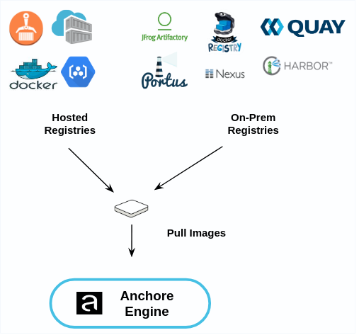

Using the API or CLI the Anchore Engine can be instructed to download an image from a public or private container registry.

The Anchore Engine will attempt to download images from any registry without requiring further configuration. However if
your registry requires authentication then the registry and corresponding credentials will need to be defined.
Anchore Engine can analyze images from any Docker V2 compatible registry.

Registry credentials can stored in the Anchore Engine for authentication or in the case of an Amazon EC2 deployment IAM roles can be used for authentication.

For more information on configuring access to registries please see here: Configuring Access to Registries.

