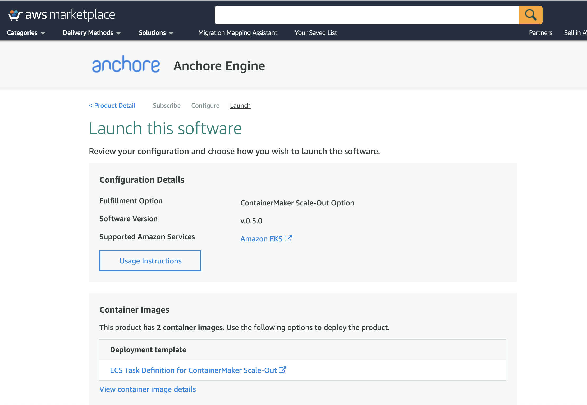

## AWS Marketplace: Anchore Engine on EKS

This document willl walkthough deploying the Anchore Engine AWS Marketplace listing on Amazon EKS.

## Prerequisites

- A running Amazon EKS cluster
- kubectl installed and configured to access your EKS cluster
- Helm installed and available in your path
- Tiller, the server side component of Helm, installed in your EKS cluster

## Anchore Engine Marketplace Listing

Navigate to the [Anchore Engine Marketplace Listing](https://aws.amazon.com/marketplace/pp/B07XZ3JZ2R), and select "Continue to Subscribe", "Continue to Configuration", and "Continue to Launch".

On the Launch Configuration screen, select "View container image details"



Selecting this will present the following popup:


Follow the steps on the popup to verify you are able to pull down the required images (Anchore Engine and Postgres) from Amazon ECR.

## Initial configuration

Create a custom `values.yaml` file to pass the Anchore Engine Helm Chart during your installation.

You will need to reference the Amazon ECR Marketplace images in this Helm chart. 

```
postgresql:
  image: 709373726912.dkr.ecr.us-east-1.amazonaws.com/e4506d98-2de6-4375-8d5e-10f8b1f5d7e3/cg-3671661136/docker.io/library/postgres
  imageTag: v.0.5.0-latest
  imagePullPolicy: IfNotPresent
anchoreGlobal:
  image: 709373726912.dkr.ecr.us-east-1.amazonaws.com/e4506d98-2de6-4375-8d5e-10f8b1f5d7e3/cg-3671661136/docker.io/anchore/anchore-engine
  imageTag: v.0.5.0-latest
  imagePullPolicy: IfNotPresent
```

**Note:** You will also need create a secret with a Docker Config in order to fetch the Amazon ECR images.

### Further configuration

For the complete list of configuration options for installation of the Anchore Helm chart, please check out the [GitHub Repository](https://github.com/anchore/anchore-charts/blob/master/stable/anchore-engine)

#### Example steps to create a secret

```
#
# RUN me where kubectl is available,& make sure to replace account,region etc
# Set ENV vars
ACCOUNT=123456789
REGION=my-region
SECRET_NAME=${REGION}-ecr-registry
EMAIL=email@email.com ( can be anything)

#
# Fetch token (which will expire in 12 hours)
#

TOKEN=`aws ecr --region=$REGION get-authorization-token --output text --query authorizationData[].authorizationToken | base64 -d | cut -d: -f2`

#
# Create registry secret
#
kubectl create secret docker-registry $SECRET_NAME --docker-server=https://${ACCOUNT}.dkr.ecr.${REGION}.amazonaws.com--docker-username=AWS --docker-password="${TOKEN}" --docker-email="${EMAIL}"
```

After the secret is created you will need to add ImagePullSecrets to a service account.

You can read more about this here:

- https://kubernetes.io/docs/concepts/containers/images/
- https://kubernetes.io/docs/tasks/configure-pod-container/configure-service-account/#add-imagepullsecrets-to-a-service-account

## Installation

Ensure you have the latest Helm Charts.

`helm repo update`

#### Install Anchore Engine

Run the following command to install the Anchore Engine Helm chart in your EKS cluster

```
helm repo add anchore https://charts.anchore.io
helm install helm install --name anchore-engine -f values.yaml anchore/anchore-engine
```