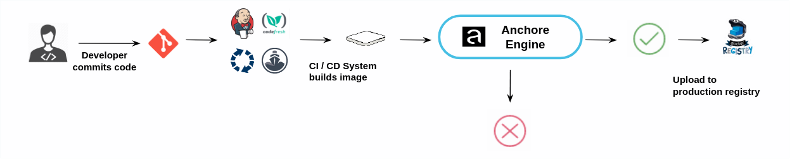

The Anchore Engine can be integrated into CI/CD pipelines such as Jenkins to secure the CI/CD pipeline by adding image scanning including not just CVE based security scans but policy based scans that can include checks around security, compliance and operational best practices.

As part of the CI/CD workflow images are submitted to the Anchore Engine for analysis. If an image does not pass the policy checks then the build can be failed.

Images that pass the policy check can be promoted to the production registry.

Some users may implement a gating workflow where policy violations fail the build, other users may prefer to allow the build to proceed but provide a warning to the developer and operations team about the violations present in the image.

A plugin is available for Jenkins that supports Freestyle jobs and Pipeline jobs.

For other CI/CD systems Integration is as simple as making two API or CLI calls to the engine

1. Submit image for analysis
2. Retrieve image policy status.

These calls can be made using the Anchore CLI or through the Anchore REST API.
